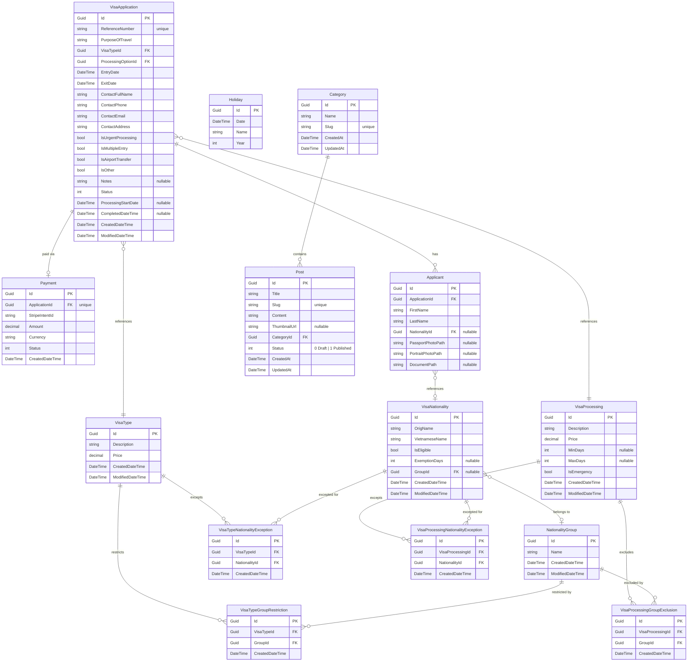

# Database Entities

## Tables

### AdminUser

Represents an admin or staff user who can authenticate with the system. Extends ASP.NET Identity's `IdentityUser` — all standard Identity columns (`Id`, `UserName`, `Email`, `PasswordHash`, etc.) are inherited.

| Column                     | Type   | Notes                                                   |
| -------------------------- | ------ | ------------------------------------------------------- |
| Id                         | string | PK — ASP.NET Identity string GUID                       |
| UserName                   | string | Inherited from `IdentityUser`; set to email on creation |
| Email                      | string | Unique — used as login credential                       |
| PasswordHash               | string | Inherited — bcrypt hash managed by ASP.NET Identity     |
| FullName                   | string | Required — display name                                 |
| IsActive                   | bool   | Default: `true`. When `false`, login returns HTTP 401   |
| _(other Identity columns)_ |        | `NormalizedEmail`, `ConcurrencyStamp`, etc.             |

> Managed by `AuthDbContext` (inherits `IdentityDbContext<AdminUser>`). Roles (`Admin`, `Staff`) are stored in the standard Identity tables (`AspNetRoles`, `AspNetUserRoles`). Seeded on startup if absent.

---

### VisaApplication

Represents a single visa application submission, covering one or more applicants.

| Column              | Type      | Notes                                                                                                                              |
| ------------------- | --------- | ---------------------------------------------------------------------------------------------------------------------------------- |
| Id                  | Guid      | PK                                                                                                                                 |
| ReferenceNumber     | string    | Unique — `"EV"` + 8 uppercase chars from a GUID                                                                                    |
| PurposeOfTravel     | string    |                                                                                                                                    |
| VisaTypeId          | Guid      | FK → VisaTypes                                                                                                                     |
| ProcessingOptionId  | Guid      | FK → VisaProcessing                                                                                                                |
| EntryDate           | DateTime  |                                                                                                                                    |
| ExitDate            | DateTime  |                                                                                                                                    |
| ContactFullName     | string    |                                                                                                                                    |
| ContactPhone        | string    |                                                                                                                                    |
| ContactEmail        | string    |                                                                                                                                    |
| ContactAddress      | string    |                                                                                                                                    |
| IsUrgentProcessing  | bool      | bit column                                                                                                                         |
| IsMultipleEntry     | bool      | bit column                                                                                                                         |
| IsAirportTransfer   | bool      | bit column                                                                                                                         |
| IsOther             | bool      | bit column                                                                                                                         |
| Notes               | string?   | Nullable                                                                                                                           |
| Status              | int       | `ApplicationStatus` enum: 0 Submitted · 1 UnderReview · 2 Approved · 3 Rejected · 4 RequiresAction · 5 Cancelled · 6 PendingReview |
| DocumentPath        | string?   | Nullable — relative path to the approved visa PDF: `documents/{referenceNumber}.pdf`                                               |
| ProcessingStartDate | DateTime? | Nullable — set in UTC on payment confirmation                                                                                      |
| CompletedDateTime   | DateTime? | Nullable — set in UTC when status → Approved or Rejected                                                                           |
| CreatedDateTime     | DateTime  | Default: DateTime.Now                                                                                                              |
| ModifiedDateTime    | DateTime  | Default: DateTime.Now                                                                                                              |

> Table name: `VisaApplications` · Unique index: `IX_VisaApplications_ReferenceNumber`

---

### Payment

Records a Stripe payment intent linked one-to-one with a `VisaApplication`.

| Column          | Type     | Notes                                                    |
| --------------- | -------- | -------------------------------------------------------- |
| Id              | Guid     | PK                                                       |
| ApplicationId   | Guid     | FK → VisaApplications (cascade delete, unique)           |
| StripeIntentId  | string   | Stripe PaymentIntent ID                                  |
| Amount          | decimal  | Precision 18,2                                           |
| Currency        | string   | Default: `"usd"`                                         |
| Status          | int      | `PaymentStatus` enum: 0 Pending · 1 Succeeded · 2 Failed |
| CreatedDateTime | DateTime | Default: DateTime.Now                                    |

> Table name: `Payments` · Unique index on `ApplicationId` (one-to-one)

---

### Applicant

Represents a single person included in a `VisaApplication`.

| Column            | Type    | Notes                                                                                                                                                                                                                                                                                |
| ----------------- | ------- | ------------------------------------------------------------------------------------------------------------------------------------------------------------------------------------------------------------------------------------------------------------------------------------ |
| Id                | Guid    | PK                                                                                                                                                                                                                                                                                   |
| ApplicationId     | Guid    | FK → VisaApplications (cascade delete)                                                                                                                                                                                                                                               |
| FirstName         | string  |                                                                                                                                                                                                                                                                                      |
| LastName          | string  |                                                                                                                                                                                                                                                                                      |
| NationalityId     | Guid?   | FK → VisaNationality.Id — logical only (different DbContext), resolved via manual lookup. Nullable: rows backfilled from the old free-text `Nationality` column that didn't match a `VisaNationality.OrigName` are left `NULL`.                                                      |
| PassportPhotoPath | string? | Relative path: `uploads/{applicationId}/{index}_passport_{filename}`                                                                                                                                                                                                                 |
| PortraitPhotoPath | string? | Relative path: `uploads/{applicationId}/{index}_portrait_{filename}`                                                                                                                                                                                                                 |
| DocumentPath      | string? | Nullable — relative path to this applicant's individual visa PDF: `documents/{referenceNumber}/{sanitizedFirstName}_{sanitizedLastName}.pdf`. Set via `POST /api/v1/applications/{id}/applicants/{applicantId}/document`. Used by the ZIP download path when `Applicants.Count > 1`. |

> Table name: `Applicants` · Index: `IX_Applicants_ApplicationId`

---

### VisaNationality

Represents a country/nationality and whether its citizens are eligible for an e-visa.

| Column           | Type     | Notes                                                                                                         |
| ---------------- | -------- | ------------------------------------------------------------------------------------------------------------- |
| Id               | Guid     | PK                                                                                                            |
| OrigName         | string   | Country name in original language                                                                             |
| VietnameseName   | string   | Country name in Vietnamese                                                                                    |
| IsEligible       | bool     | Whether this nationality can apply for e-visa                                                                 |
| ExemptionDays    | int?     | Visa-free days granted; `NULL` means no exemption                                                             |
| GroupId          | Guid?    | Nullable — logical FK → NationalityGroup.Id (different DbContext). A nationality belongs to at most one group |
| CreatedDateTime  | DateTime | Default: DateTime.Now                                                                                         |
| ModifiedDateTime | DateTime | Default: DateTime.Now                                                                                         |

> Table name: `VisaNationality`

---

### NationalityGroup

A named cohort of nationalities that `VisaType` and `VisaProcessing` records use to restrict/exclude nationalities as a unit instead of one at a time.

| Column           | Type     | Notes                 |
| ---------------- | -------- | --------------------- |
| Id               | Guid     | PK                    |
| Name             | string   |                       |
| CreatedDateTime  | DateTime | Default: DateTime.Now |
| ModifiedDateTime | DateTime | Default: DateTime.Now |

> Table name: `NationalityGroup` · Managed by `NationalityGroupContext`

---

### VisaTypeGroupRestriction

Flags a `NationalityGroup` as requiring mandatory review (Pending) for a given `VisaType`.

| Column          | Type     | Notes                                        |
| --------------- | -------- | -------------------------------------------- |
| Id              | Guid     | PK                                           |
| VisaTypeId      | Guid     | Logical FK → VisaTypes (different DbContext) |
| GroupId         | Guid     | FK → NationalityGroup                        |
| CreatedDateTime | DateTime | Default: DateTime.Now                        |

> Table name: `VisaTypeGroupRestriction` · Unique index on `(VisaTypeId, GroupId)` · Managed by `NationalityGroupContext`

---

### VisaTypeNationalityException

A specific (VisaType, Nationality) pair that lifts a `VisaTypeGroupRestriction` for that pair only — the application is not routed to Pending even though the nationality's group is restricted.

| Column          | Type     | Notes                                              |
| --------------- | -------- | -------------------------------------------------- |
| Id              | Guid     | PK                                                 |
| VisaTypeId      | Guid     | Logical FK → VisaTypes (different DbContext)       |
| NationalityId   | Guid     | Logical FK → VisaNationality (different DbContext) |
| CreatedDateTime | DateTime | Default: DateTime.Now                              |

> Table name: `VisaTypeNationalityException` · Unique index on `(VisaTypeId, NationalityId)` · Managed by `NationalityGroupContext`

---

### VisaProcessingGroupExclusion

Flags a `NationalityGroup` as unavailable by default for a given `VisaProcessing` option — a hard block, not a review flag.

| Column           | Type     | Notes                                             |
| ---------------- | -------- | ------------------------------------------------- |
| Id               | Guid     | PK                                                |
| VisaProcessingId | Guid     | Logical FK → VisaProcessing (different DbContext) |
| GroupId          | Guid     | FK → NationalityGroup                             |
| CreatedDateTime  | DateTime | Default: DateTime.Now                             |

> Table name: `VisaProcessingGroupExclusion` · Unique index on `(VisaProcessingId, GroupId)` · Managed by `NationalityGroupContext`

---

### VisaProcessingNationalityException

A specific (VisaProcessing, Nationality) pair that lifts a `VisaProcessingGroupExclusion` for that pair only — the processing option becomes fully selectable again, as if never excluded.

| Column           | Type     | Notes                                              |
| ---------------- | -------- | -------------------------------------------------- |
| Id               | Guid     | PK                                                 |
| VisaProcessingId | Guid     | Logical FK → VisaProcessing (different DbContext)  |
| NationalityId    | Guid     | Logical FK → VisaNationality (different DbContext) |
| CreatedDateTime  | DateTime | Default: DateTime.Now                              |

> Table name: `VisaProcessingNationalityException` · Unique index on `(VisaProcessingId, NationalityId)` · Managed by `NationalityGroupContext`

---

### VisaType

Represents a category of visa (e.g. tourist, business).

| Column           | Type     | Notes                    |
| ---------------- | -------- | ------------------------ |
| Id               | Guid     | PK                       |
| Description      | string   |                          |
| Price            | decimal  | Price for this visa type |
| CreatedDateTime  | DateTime | Default: DateTime.Now    |
| ModifiedDateTime | DateTime | Default: DateTime.Now    |

> Table name: `VisaTypes`

---

### VisaProcessing

Represents a processing speed / service tier (e.g. normal, express).

| Column           | Type     | Notes                              |
| ---------------- | -------- | ---------------------------------- |
| Id               | Guid     | PK                                 |
| Description      | string   |                                    |
| Price            | decimal  | Price for this processing option   |
| MinDays          | int?     | Nullable — minimum processing days |
| MaxDays          | int?     | Nullable — maximum processing days |
| IsEmergency      | bool     | bit column — default: `false`      |
| CreatedDateTime  | DateTime | Default: DateTime.Now              |
| ModifiedDateTime | DateTime | Default: DateTime.Now              |

> Table name: `VisaProcessing`

---

### Holiday

Represents a Vietnamese public holiday for a given year, used to exclude non-working days from processing time estimates.

| Column | Type     | Notes                   |
| ------ | -------- | ----------------------- |
| Id     | Guid     | PK                      |
| Date   | DateTime | Holiday date            |
| Name   | string   | Holiday name            |
| Year   | int      | Calendar year (indexed) |

> Table name: `Holidays` · Index: `IX_Holidays_Year`

---

### Category

Represents a named group that posts are organized under.

| Column    | Type     | Notes                                                      |
| --------- | -------- | ---------------------------------------------------------- |
| Id        | Guid     | PK                                                         |
| Name      | string   | Required                                                   |
| Slug      | string   | Unique — auto-generated from name; user-editable on update |
| CreatedAt | DateTime | UTC                                                        |
| UpdatedAt | DateTime | UTC                                                        |

> Table name: `Categories` · Unique index: `IX_Categories_Slug` · Managed by `PostsDbContext`

---

### Post

Represents a content post (visa guide, news, announcement, etc.) belonging to a category.

| Column       | Type     | Notes                                                                                   |
| ------------ | -------- | --------------------------------------------------------------------------------------- |
| Id           | Guid     | PK                                                                                      |
| Title        | string   | Required                                                                                |
| Slug         | string   | Unique — auto-generated from title; user-editable. Numeric suffix appended on collision |
| Content      | string   | Required — HTML allowed                                                                 |
| ThumbnailUrl | string?  | Nullable — external URL                                                                 |
| CategoryId   | Guid     | FK → Categories                                                                         |
| Status       | int      | `PostStatus` enum: `0` Draft · `1` Published. Default: `0`                              |
| CreatedAt    | DateTime | UTC                                                                                     |
| UpdatedAt    | DateTime | UTC                                                                                     |

> Table name: `Posts` · Unique index: `IX_Posts_Slug` · Managed by `PostsDbContext`

---

## Relationships

- **VisaApplication → Applicant**: One-to-many. FK `ApplicationId` on `Applicants` with cascade delete.
- **VisaApplication → Payment**: One-to-one. FK `ApplicationId` on `Payments` with cascade delete.
- **VisaApplication → VisaType**: Many-to-one. FK `VisaTypeId` on `VisaApplications`.
- **VisaApplication → VisaProcessing**: Many-to-one. FK `ProcessingOptionId` on `VisaApplications`.
- **Applicant → VisaNationality**: Many-to-one, nullable. FK `NationalityId` on `Applicants`.
- **VisaNationality → NationalityGroup**: Many-to-one, nullable. FK `GroupId` on `VisaNationality`. A nationality belongs to at most one group.
- **NationalityGroup → VisaType**: Many-to-many via `VisaTypeGroupRestriction`.
- **NationalityGroup → VisaProcessing**: Many-to-many via `VisaProcessingGroupExclusion`.
- **VisaType + VisaNationality → VisaTypeNationalityException**: Composite, one exception row per (VisaType, Nationality) pair.
- **VisaProcessing + VisaNationality → VisaProcessingNationalityException**: Composite, one exception row per (VisaProcessing, Nationality) pair.
- **Category → Post**: One-to-many. FK `CategoryId` on `Posts`. Deleting a category with posts is blocked at the service layer (returns `409`).

> Note: `VisaType`, `VisaProcessing`, `VisaNationality`, and `NationalityGroup` (and its restriction/exclusion/exception tables) live in separate DbContexts from `VisaApplication` and from each other, so all cross-context FKs above are logical only — not enforced by EF navigation properties.

### Summary

- **VisaApplication**: Top-level submission record. Stores FK references to `VisaType` and `VisaProcessing` by ID. Deleted application cascades to its `Applicant` and `Payment` rows.
- **Payment**: One-to-one with `VisaApplication`. Tracks the Stripe PaymentIntent and its lifecycle (Pending → Succeeded/Failed).
- **Applicant**: Per-person record linked to a `VisaApplication`. Photo files stored on disk; relative paths in `PassportPhotoPath` / `PortraitPhotoPath`.
- **VisaNationality**: Exemption data stored inline as nullable `ExemptionDays`. `NULL` means no visa exemption. `GroupId` places it in at most one `NationalityGroup`.
- **NationalityGroup**: Cohort of nationalities. Referenced by `VisaTypeGroupRestriction` (soft — Pending) and `VisaProcessingGroupExclusion` (hard — removed from choices), each with its own per-nationality `*NationalityException` table that fully lifts the restriction/exclusion for that one pair.
- **VisaType**: Owns its own `Price` column.
- **VisaProcessing**: Owns its own `Price` column.
- **Category**: Flat organizational group. Deletion blocked at service layer if posts exist.
- **Post**: Content record with auto-generated slug, optional thumbnail URL, and `Draft`/`Published` status. Belongs to exactly one `Category`.

---

## DbContext Classes

The application uses a **multi-DbContext architecture** — 8 separate `DbContext` instances, each registered in `Program.cs` with the shared connection string `"VisaDatabase"` (PostgreSQL, via Npgsql).

| DbContext                 | DbSets                                                                                                                                          | Migration folder               |
| ------------------------- | ----------------------------------------------------------------------------------------------------------------------------------------------- | ------------------------------ |
| `ApplicationDbContext`    | VisaApplications, Applicants, Payments                                                                                                          | `Migrations/Application/`      |
| `VisaNationalityContext`  | VisaNationalities                                                                                                                               | `Migrations/` (root)           |
| `VisaTypeContext`         | VisaTypes                                                                                                                                       | `Migrations/VisaType/`         |
| `VisaProcessingContext`   | VisaProcessings                                                                                                                                 | `Migrations/VisaProcessing/`   |
| `NationalityGroupContext` | NationalityGroups, VisaTypeGroupRestrictions, VisaTypeNationalityExceptions, VisaProcessingGroupExclusions, VisaProcessingNationalityExceptions | `Migrations/NationalityGroup/` |
| `HolidayContext`          | Holidays                                                                                                                                        | `Migrations/Holiday/`          |
| `AuthDbContext`           | AdminUsers + Identity tables                                                                                                                    | `Migrations/Auth/`             |
| `PostsDbContext`          | Categories, Posts                                                                                                                               | `Migrations/Posts/`            |

All table mappings and relationships are defined in each context's `OnModelCreating` method.

---

## Entity Relationship Diagram

